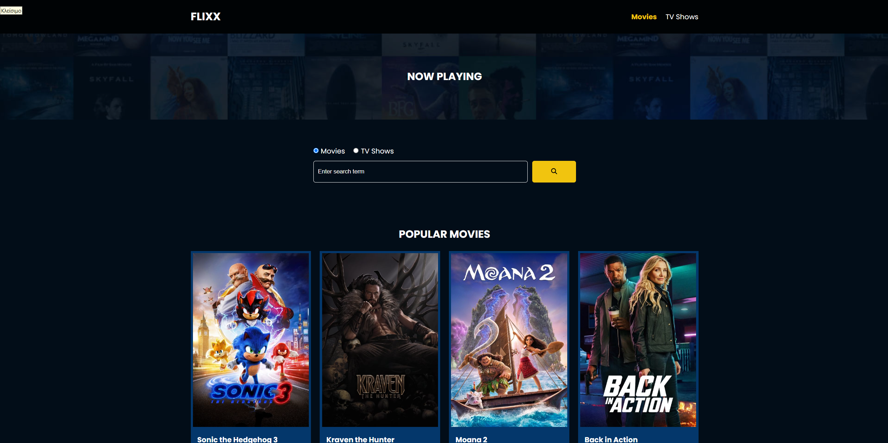
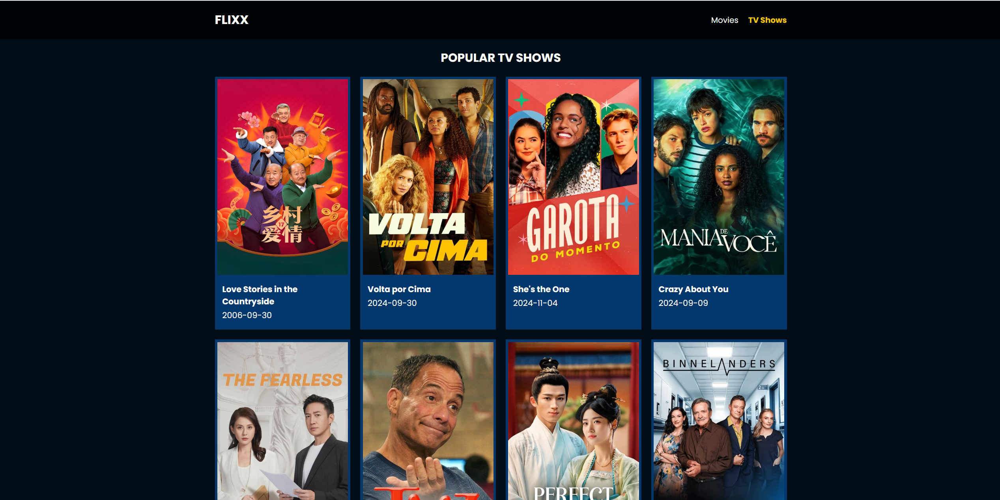

# 🎥 Flixx - Movie & TV Show App 🍿

Flixx is a web application that allows users to browse popular movies and TV shows, view detailed information about them, and search for specific titles. The app fetches real-time data from [The Movie Database (TMDB)](https://www.themoviedb.org/) API.

## ⭐ Features
- 🎬 **Display popular movies and TV shows**
- 🔍 **Search for movies and TV shows**
- 📝 **View detailed information about movies and TV series**
- 🌐 **Dynamic routing for movie and TV show details**
- 📱 **Responsive design using HTML, CSS, and JavaScript**

## 🛠 Technologies Used
- 🏗 **HTML** - Structuring the web pages
- 🎨 **CSS** - Styling and layout
- ⚡ **JavaScript** - Fetching and displaying data dynamically
- 🎞 **TMDB API** - Fetching real-time movie and TV show data

## 🚀 Installation & Setup
### 🔹 Clone the repository:
```sh
   git clone https://github.com/your-username/flixx-app.git
```

### 🔹 Navigate to the project directory:
```sh
   cd flixx-app
```

### 🔹 Open `index.html` in your browser.

## 🔑 API Configuration
To fetch data from TMDB, ensure you have a valid API key:
- 🔗 Get an API key from [TMDB](https://www.themoviedb.org/settings/api)
- ✏️ Replace the placeholder `API_KEY` in the JavaScript file:
  ```js
  const API_KEY = 'your_api_key_here';
  ```

## 📸 Screenshots
🖼 **Home Page:**


📺 **TV Shows Page:**


## 📜 License
🛑 This project is for educational purposes only and is not intended for commercial use.

## 🙌 Credits
This project is based on the **Udemy course** by [Brad Traversy](https://www.udemy.com/user/brad-traversy/), with additional customizations and improvements.

---
🎬 **Enjoy browsing your favorite movies and TV shows with Flixx! 🍿**

